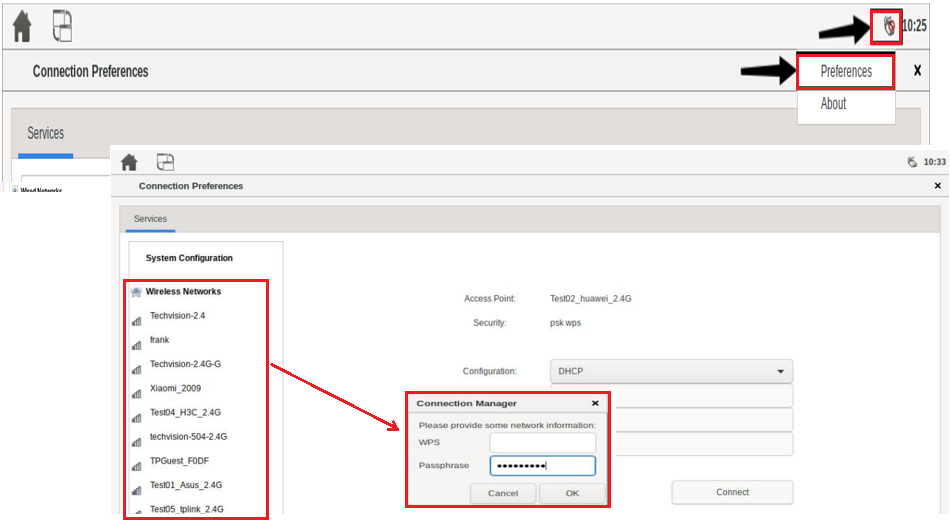

# Jabil JSOM Horizon Developing Notes

+ [Introduction to WiFi Device Test](inc/wifi-device-test.pdf)

--------------------------------------------------------------------------------
# CLI Test Commands

```bash
# start CLI test process
$ techvision_cli

# set log level: 0-3
$ log $level

# exit CLI test process
$ exit

# print help message
$ help
```

+ Audio Test
    + parameters
        + -f [sampling format]
        + -c [channel]
        + -D [pcm device name]
        + -r [sampling rate]
        + -F [file path]
            + default input file: /oem/1Khz_sine_wave.wav
            + default save path: /tmp/test.wav
        + -h: print help message
    + TVAOPH: audio output from headphone
    + TVAOPS: audio output from speaker
    + TVAIPA: audio input from analog mic
    + TVAIPD: audio output from dmic
+ LCD Backlight Test
    + parameters
        + -b [brightness: 0-255]
        + -D [device number: 0|1]
        + -h: print help message
    + TVBKLA: auto test; brightness value goes from min to max, from max to min and then to default
    + TVBKLR: get brightness value
    + TVBKLW: set brightness value
+ UART Test
    + parameters
        + -w [string]
        + -D [device: /dev/ttySx]
        + -h: print help message
    + TVURTA: auto tx/rx test; use TVSTOP to stop test
    + TVURTR: read data from the specified port
    + TVURTW: write data to the specified port
+ RTC Test
    + TVRTCR: read RTC
        + example output: 2020-1-7, 10:22:27.
    + TVRTCW: write RTC
+ LED Test
    + parameters
        + -b [indicator on|off: 1-255|0]
        + -D [indicator green|red: 0|1]
        + -h: print help message
    + TVLEDA: auto test
    + TVLEDR -D [indicator]: get LED status
        + example output: Get red_led brightness = 0
    + TVLEDW -D [indicator] -b [status]: set LED status
+ USB Type-C Port Test
    + parameters
        + -m [mode otg|host|peripheral: 0|1|2]
        + -h: print help message
    + TVTPCR: read mode
        + example output: [INFO] Type-C mode = otg
    + TVTPCW -m [mode]: write mode
+ USB Host Port Test
    + parameters
        + -t [timeout(sec)]: 10 sec by default
        + -h: print help message
    + TVUSBA: auto test
+ GPIO Test
    + parameters
        + -D [port number e.g. GPIO2 C1: 2-c-1]
        + -d [direction: out|in]
        + -v [level: 0|1]: 0 by default
        + -h: print help message
    + TVGIOR: read value
        + e.g. TVGIOR -D 2-c-2
    + TVGIOW: write value
        + e.g. TVGIOW -D 2-c-2 -d out -v 1
+ ADC Test
    + parameters
        + -c [channel: 0-7]: all channels by default
        + -h: print help message
    + TVADCR: read raw data
        + e.g. TVADCR -c 3
        + e.g. TVADCR
+ Button Test
    + TVKEYR: read key press
        + TVSTOP to exit
+ SD Card Test
    + parameters
        + -t [timeout(sec)]: 10 sec by default
        + -h: print help message
    + TVSDCA -t [timeout]: auto test
+ Ethernet Test
    + TVETHR: read eth card status
+ WiFi Test
    + TVWIFR: read wifi status
+ Bluetooth Test
    + TVBTR: read bluetooth module MAC address and scan devices
+ LTE Test
    + TV4GMR: get 4G module status(hot-plug not supported)
    + TV5GMR: get 5G module status(hot-plug not supported)
+ SATA Port Test
    + TVSDAR: read the conected SATA disk drive status
+ CAN Port Test
    + TVCANE: exit test
    + TVCANI: initialize test
    + TVCANR: read test
    + TVCANW: write test

--------------------------------------------------------------------------------
# Manual Test Commands

## Audio Test

```bash
# 3.5mm headphone
$ aplay -D hw:rockchiprk809co,0 ./music_test.wav

# speaker
$ aplay -D hw:rockchiprk809co,0 ./music_test.wav

# HDMI
$ aplay -D hw:rockchiphdmi,0 ./music_test.wav

# Analog Microphone
$ arecord -D hw:rockchiprk809co,0 -f cd ./test.wav

# Digital Microphone
$ arecord -D hw:rockchippdmmica,0 -f cd ./test.wav

# PDM Array
$ arecord -D hw:rockchippdmmica,0 -f cd -c 6 ./test.wav
```

## 4G Module Test

```bash
# use GobiNet driver by default
$ quectel-CM &
$ ifconfig usb0

# check if IP is acquired
```

## SATA HDD/SSD Test

```bash
# check if there is disk information
$ fdisk -l
```

## USB Port Test

+ connect USB mouse/keyboard
+ connect USB disk drive and read/write files
+ connect USB headset and play audio files

## Ethernet Test

```bash
# check if there is MAC/IP address
$ ifconfig　eth0
```

## WiFi Test



## Bluetooth Test

```bash
# enable and reload bluetooth function
$ connmanctl disable bluetooth
$ connmanctl enable bluetooth
$ /etc/setup_wifibt.sh start

# get bluetooth device info
$ hcitool dev 

Devices:
        hci0    D4:9C:DD:92:89:E1

# scan for bluetooth devices
$ hcitool scan 
```

--------------------------------------------------------------------------------
# WiFi Connection

## Method 1

```bash
$ vi /data/cfg/wpa_supplicant.conf

# if changed, run 'wpa_cli -i wlan0 -p new_ctrl_interface'
ctrl_interface=/var/run/wpa_supplicant
ap_scan=1
# save wpa_cli config to .conf file (wpa_cli save_config)
update_config=1
network = {
    ssid="MY_SSID"
    psk="MY_PASSWORD"
    # encryption method
    key_mgmt=WPA-PSK
    # if not encrypted
    #key_mgmt=NONE 
}

# reload configuration
$ wpa_cli -i wlan0 -p /var/run/wpa_supplicant reconfigure

# start connection
$ wpa_cli -i wlan0 -p /var/run/wpa_supplicant reconnect
```

## Method 2

```bash
# encrypted
$ AP_SSID=dlink
$ AP_SSID=dlink
$ wpa_cli -i wlan0 -p /var/run/wpa_supplicant remove_network 0
$ wpa_cli -i wlan0 -p /var/run/wpa_supplicant ap_scan 1
$ wpa_cli -i wlan0 -p /var/run/wpa_supplicant add_network
$ wpa_cli -i wlan0 -p /var/run/wpa_supplicant set_network 0 ssid '"dlink"'
$ wpa_cli -i wlan0 -p /var/run/wpa_supplicant set_network 0 key_mgmt WPA-PSK
$ wpa_cli -i wlan0 -p /var/run/wpa_supplicant set_network 0 psk '"12345678"'
$ wpa_cli -i wlan0 -p /var/run/wpa_supplicant select_network 0
$ wpa_cli -i wlan0 -p /var/run/wpa_supplicant save_config

# unencrypted
$ AP_SSID=dlink
$ wpa_cli -i wlan0 -p /var/run/wpa_supplicant remove_network 0
$ wpa_cli -i wlan0 -p /var/run/wpa_supplicant ap_scan 1
$ wpa_cli -i wlan0 -p /var/run/wpa_supplicant add_network
$ wpa_cli -i wlan0 -p /var/run/wpa_supplicant set_network 0 ssid '"$AP_SSID"'
$ wpa_cli -i wlan0 -p /var/run/wpa_supplicant set_network 0 key_mgmt NONE
$ wpa_cli -i wlan0 -p /var/run/wpa_supplicant select_network 0
$ wpa_cli -i wlan0 -p /var/run/wpa_supplicant save_config

# get connection status
$ wpa_cli -i wlan0 -p /var/run/wpa_supplicant status

# get scan results
$ wpa_cli -i wlan0 -p /var/run/wpa_supplicant scan_results
```
